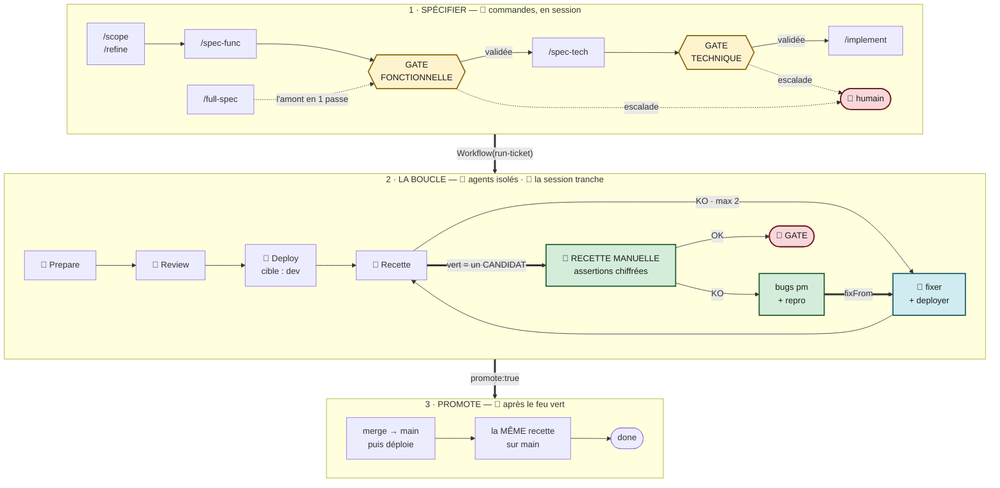
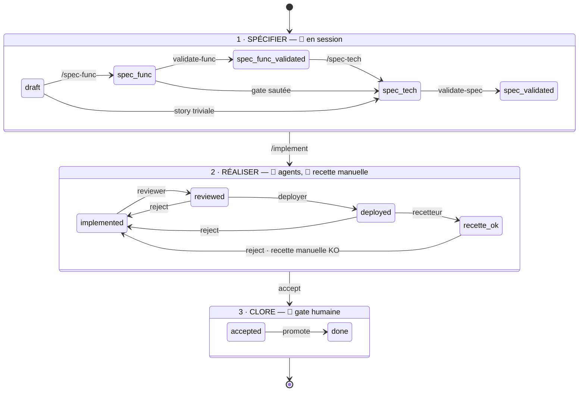

# harry-sdlc-local — engine SDLC agentique local « Harry »

**Engine réutilisable, project-agnostic.** Opère sur des repos **data** séparés (`<projet>-sdlc-local`)
qui stockent les tickets (`.md` + `status.json`). Un moteur, plusieurs jeux de données (SAMPLE, OtherProject…).

> PRD / modèle conceptuel : [`docs/PRD.md`](docs/PRD.md). Objectif à terme : migration vers
> `harry-sdlc-ai-factory` (gates→HITL, agents→heavy drivers, `run-ticket`→`TicketWorkflow`).

## Quickstart
```bash
git clone --depth 1 --branch v0.7.1 https://github.com/harry-agentic-factory/harry-sdlc-local \
  && ./harry-sdlc-local/install.sh v0.7.1   # version publiée ; `sdlc --version` = 0.7.1 (release)
# développeur du moteur : dans un clone, `make install` (= install.sh --dev .) puis `make test`

# 1 projet = 1 repo data
sdlc init-project SAMPLE --path ../sample-proj-sdlc-local --repos app-repo,web-repo
sdlc --project SAMPLE list                # data prête (vide)
```
Puis, dans **Claude Code** : `/harry techlead` → `/scope <une idée>` → `/refine` → `/spec-tech` → `/implement`,
puis « **lance run-ticket sur <TICKET>** » (tronçon autonome). Détail : **§ Découverte pas à pas** ci-dessous.
**Raccourci mono-user** : `/full-spec <un besoin>` produit **d'un coup** PRD + refine + stories + spec-func +
spec-tech (une personne portant PO+BA+techlead) — idéal pour un besoin rapide ou une session solo.
Prérequis : Python 3.11+ ; Claude Code pour les slash-commands & workflows.

## Les 4 couches (rappel)
1. **Méthode/lifecycle** · 2. **Mémoire/état** (repo data) · 3. **Chef interactif** (Harry, session) ·
4. **Fleet + orchestration** (agents + Workflow). Agents à contextes **isolés** → mémoire + coordination
**externalisées** (couches 2 & 4), sinon le lifecycle tourne dans le vide.

## Le workflow, de bout en bout

Deux segments de nature différente, deux gates, et une boucle qui se referme sur le **fixer**.



| Bande | Qui | Ce qui s'y joue |
|---|---|---|
| **1 · Spécifier** | 🧑 session | `/scope /refine /spec-func` → **gate fonctionnelle** (`validate-func` : PRD + refine + TOUS les spec-func, en batch ou story par story) → `/spec-tech` → **gate technique** (`validate-spec` : plan + invariants). `harry-archi` tranche, escalade produit / sécu / PII. `/implement` ouvre la **bulle scopée** (worktree + skills projet). |
| **2 · La boucle** | 🤖 + 🧑 | `Workflow(run-ticket.js)` enchaîne *Prepare → Review → Deploy → Recette*, agents à contextes isolés. La **recette manuelle** de la session tranche ; chaque bug devient un item `pm` + un bundle repro, et le tour suivant **ré-entre au fixer**. |
| **3 · Promote** | 🤖 | Après le feu vert humain seulement : merge → `main`, redéploiement sur **l'intégration**, puis **la même recette rejouée sur main**. |

### Ce que le dessin dit, en trois phrases

**La boucle se referme sur le fixer, pas au début.** `fixFrom` saute la review et le premier
déploiement — déjà faits. Le triplet `fixer → deployer → recetteur` tourne depuis **deux portes** : le
workflow l'enchaîne seul quand la recette *agent* échoue (`MAX_FIX = 2`), la session le relance quand
c'est la recette *manuelle* qui trouve. On boucle jusqu'à épuisement du stock de bugs.

**Le vert d'un agent n'est pas une conclusion.** Un recetteur se fait tromper par un mock, une assertion
molle, un écran qui s'affiche sans rien prouver. C'est la recette **manuelle** qui fait foi.

**Le loop vit dans le monde du développeur.** Deploy vise un dev dédié ou un éphémère de story, Promote
vise l'intégration. La mise en production, sa CI/CD et sa recette classique sont un autre univers.

### La state-machine



Les deux gates sont **sautables** dans la machine — `spec_func → spec_tech` et `spec_tech → implemented`
(cette dernière est la flèche `/implement` sortant de la bande 1 depuis `spec_tech`). La version dure est
portée par l'**orchestration** ; la machine tolère le saut pour ne pas casser les flux existants.
`reject --to` est la sortie de secours, et elle journalise sa raison.

### Qui tourne où, et pourquoi la coupure est là

| | Commandes (`/scope` … `/implement`) | Agents (`run-ticket.js`) |
|---|---|---|
| Contexte | la **session** | **isolé**, un par phase |
| Peut parler à l'humain | oui | non — rend du JSON |
| Nature du travail | jugement, arbitrages produit | mécanique, parallélisable |
| « auto » veut dire | « je n'attends pas ton feu vert à chaque étape » | « sans toi, jusqu'à la gate » |

On ne met donc **pas** `/scope` dans un script Workflow : le Workflow orchestre des agents, pas des
commandes. Corollaire technique — un script Workflow n'a **aucune primitive shell** (`agent`, `parallel`,
`pipeline`, `log`, `phase`, pas de `bash`) : c'est pourquoi la phase `Prepare` est un agent dont le seul
travail est de lancer `sdlc workspace` et d'en rendre le JSON. `/implement` appelle la **même** commande,
qui « crée ou assure » — deux points d'appel, zéro logique dupliquée.

**`/run-story <STORY>`** déroule tout ça depuis l'état où la story se trouve, et s'arrête aux gates.
C'est ce que veut dire « vas-y en mode auto ».

## Contenu
```
VERSION                    # version d'engine (semver) — source unique (paquet, tag, sdlc --version)
CHANGELOG.md               # Keep a Changelog ; section [X.Y.Z] = notes de la Release
install.sh · Makefile      # install.sh vX.Y.Z | --dev <chemin> ; make install = --dev
scripts/                   # check-tag-version, changelog-section, wheel-smoke, ci-local (règles de release)
.github/workflows/         # ci.yml (PR/push) · release.yml (tag vX.Y.Z → GitHub Release)
claude/
  agents/      reviewer, deployer, recetteur, fixer, e2e-author, nonreg-runner, demo
  commands/    harry, scope, refine, spec-func, spec-tech, full-spec (one-shot), implement, ticket,
               run-story (le « mode auto » : enchaîne tout depuis l'état courant), sdlc (état en session)
  workflows/   run-ticket.js (gates) · run-ticket-full-auto.js (env d'intégration)
  skills/      loop-engineering (mode op du run auto) · deploy-jenkins · recette · agent-resilience (discipline agents longs)
  sdlc/        harry.md (persona)
tooling/
  sdlc/        state-machine, DAG, workspace, board, service, cli, mcp_server, migrations/, brain/
  cockpit/     board + Inbox HITL (FastAPI + page)
  tests/       216 tests (déterministe, offline)
docs/PRD.md
```

## Installer / tester

L'installation se fait **sur un tag** (`vX.Y.Z`) ou, explicitement, sur une **copie de travail** (`--dev`) :
```bash
# amorçage (première installation) : un clone jetable au tag, qui s'installe lui-même
git clone --depth 1 --branch v0.7.1 https://github.com/harry-agentic-factory/harry-sdlc-local \
  && ./harry-sdlc-local/install.sh v0.7.1
~/.local/share/harry-sdlc/current/install.sh v0.7.1   # montée de version (clone détaché au tag)
~/.local/share/harry-sdlc/current/install.sh v0.7.0   # retour arrière : bascule seule, aucun clone
./install.sh --dev "$PWD"                             # mode dev : `current` = cette copie (= make install)
sdlc --version        # 0.7.1 (release)  |  0.7.1-dev+<sha>[.dirty] (dev: <chemin>)
make test             # pytest du cœur déterministe
```
```
~/.local/share/harry-sdlc/         ($HARRY_SDLC_HOME)
├── v0.7.0/  v0.7.1/               clones détachés aux tags, jamais modifiés
└── current -> v0.7.1              version active (ou chemin d'une copie en --dev)
~/.claude/{agents,commands,workflows,skills}/<x>, ~/.claude/sdlc/harry.md, <dossier du PATH>/sdlc
                                   liens vers ~/.local/share/harry-sdlc/current/…
```
- `install.sh` **exige** un argument (`vX.Y.Z` ou `--dev <chemin>`) ; un tag ≠ `v` + `VERSION` du clone, ou une
  branche, est **refusé** sans rien changer (même script que la Release : `scripts/check-tag-version.sh`).
- Basculer / revenir = déplacer `current` (renommage atomique) : les liens de `~/.claude` ne changent pas.
- Les liens de l'ancien mode (vers une copie `harry-sdlc-local`) sont **migrés** ; un fichier réel ou un lien
  tiers n'est jamais touché (avertissement) ; `projects.json` est créé seulement s'il manque ; `profile`,
  `locks/`, `agent_runs.log`, `settings.json` ne sont jamais lus ni écrits. Idempotent.
- Variables : `HARRY_SDLC_HOME` (défaut `~/.local/share/harry-sdlc`), `HARRY_SDLC_REPO` (défaut : l'URL GitHub
  publique ; ex. un dépôt nu local pour tester), `CLAUDE_HOME` (défaut `~/.claude`).

La commande **`sdlc`** est posée dans le dossier du PATH qui porte déjà un lien `sdlc` du moteur, sinon le premier
dossier inscriptible parmi `/usr/local/bin`, `/opt/homebrew/bin`, `~/.local/bin`. Ensuite :
```bash
sdlc projects                        # projets enregistrés
sdlc --project SAMPLE get SAMPLE-APPS-1     # réhydrate un ticket
sdlc --project SAMPLE config            # manifest RÉSOLU (repos→chemins abs, brain, deploy…)
sdlc --project SAMPLE status [EPIC|STORY]  # statut EXACT : état + artefacts produits + recaps agents
sdlc SAMPLE-APPS                        # sous-commande devinée (préfixe/fuzzy) ; ID nu → défaut `status`
sdlc --project SAMPLE reject SAMPLE-1 --to spec_tech --note "…"  # gate : rejet routé + journal (newest-first)
sdlc --project SAMPLE worktree SAMPLE-1 --branch feat/x   # worktree(s) isolé(s) du ticket (create-or-reuse)
sdlc --project SAMPLE worktree-clean SAMPLE-1            # remove si la branche est mergée sur refBranch
sdlc --project SAMPLE workspace SAMPLE-1 --branch feat/x  # bulle scopée : worktrees + settings.json + skills projet
sdlc init-project OTHER --path … --repos a,b   # nouveau projet
sdlc migrate --project SAMPLE           # migrer la data
```
**Ergonomie** : `--project` est **optionnel** si tu es **dans un repo du projet** (le projet est déduit du
**CWD** via `reposRoot`/repos du manifest, sans hypothèse de naming). La frappe est **tolérante** (préfixe +
fuzzy). En session Claude, **`/sdlc <args>`** lance ces commandes et rend la sortie lisible.

### Worktrees — code isolé par ticket (autonomie des agents)
`1 ticket = 1 branche = 1 worktree`, réutilisé par **tous** les agents du ticket (fix-loop fluide,
zéro collision avec la session ou un autre agent). Chemin **déterministe** `<parent>/_wt/<repo>/<branche>`.
- `sdlc worktree <STORY> [--repo r] [--branch b] [--base b]` — **create-or-reuse** (git interdit un
  2ᵉ checkout d'une branche → réutilise) pour chaque repo touché du ticket.
- `sdlc worktree-clean <STORY> [--ref origin/main]` — **remove** worktree + `branch -d` **seulement si**
  la branche est mergée sur `refBranch` (du manifest). `remove` ne détruit **pas** les commits.

### Bulle scopée de l'agent (`sdlc workspace`) — droits + isolation + skills
`sdlc workspace <STORY> --branch <b>` **assemble** la bulle d'un agent, session-indépendante :
- **worktrees** (create-or-reuse) pour chaque repo touché ;
- **`.claude/settings.json`** avec `additionalDirectories` = **worktrees + brain + data**, et *rien d'autre*
  (fini le workspace VS Code hérité / le home-grant global) ;
- **skills projet** : symlink de `<data>/skills/*` dans le `.claude/skills` de la bulle (2-tiers :
  générique = engine, spécifique = projet) ;
- **identité** : `credentials.source` héritée du manifest.

Dossier **régénérable** sous `<reposRoot>/_agentws/<PREFIX>/<STORY>/`, prêt pour un lancement **headless**
(préfigure le sandbox factory). C'est la brique **droits scopés** de la pile d'autonomie.

**Intégré à l'orchestration** : `run-ticket*.js` ouvre par une phase **Prepare** (`sdlc workspace` →
worktree isolé, passé comme repo à tous les agents) et le full-auto termine par **Cleanup**
(`sdlc worktree-clean` → remove worktree + bulle **si mergé** sur `refBranch`). Côté logique de
référence, `orchestrator.py` thread la bulle dans le `ctx` des agents et `accept(..., finalize=...)`
déclenche le nettoyage post-`done`.
(Le registre `~/.claude/sdlc/projects.json` mappe `<PREFIX>` → repo data.) Workflows :
`Workflow({scriptPath:'~/.claude/workflows/run-ticket*.js', args:{…}})`.

### Le manifest (`sdlc.config.json`) = la carte du projet
Source de vérité lue par **les agents** via `sdlc config` (au lieu de reverse-engineerer l'infra) :
```jsonc
{ "prefix": "SAMPLE",
  "reposRoot": "/abs/parent",              // base ; les repos ci-dessous se résolvent par <reposRoot>/<nom>
  "repos": { "app-repo": null, "ops-repo": "/opt/ops" },  // name→path (null ⇒ via reposRoot)
  "roles": { "app-repo": "code", "ops-repo": "gitops" },
  "brain": "sample-brain",                 // pointeur connaissance (résolu abs)
  "brainRef": "main",                      // optionnel : branche, tag ou sha lu dans le Brain (défaut main puis master)
  "refBranch": "main",                     // cible de merge ⇒ cleanup worktree
  "deploy": { "app-repo": { "skill": "deploy-jenkins", "ci": "prod/app/ci", "gitops": "ops@prod" } },
  "escalation": { … }, "schemaVersion": "0.2.0" }
```
`sdlc config` renvoie la vue **résolue** (chemins absolus) ; `sdlc config --raw` renvoie le fichier brut.
`sdlc config` ajoute `brainRef` (la ref retenue), `brainCommit` (sha résolu, **sans fetch**) et `brainRefFrom`
(`origin` | `local` | `tag` | `sha`) ; ref introuvable ou Brain hors git ⇒ `null` + un avertissement JSON sur stderr.

### Brain (`sdlc brain`) — le dépôt de connaissance lu à un commit
Le Brain est un dépôt git (ou un sous-dossier d'un dépôt) ; git est sa seule vérité. Une **note** = un `*.md` suivi
au commit lu, hors `.claude/` et `hooks/` ; seul en-tête exigé : `category` (`produit`, `usage`, `archi`, `repo`,
`config`, `cicd`, `exploit`, `observ`). Rien n'est lu dans la copie de travail. Référence : [`docs/brain.md`](docs/brain.md).
```bash
sdlc brain normalize --repo <brain> [--map brain-map.yaml] [--base main] [--branch b] [--dry-run] [--report r.md]
sdlc brain lint      --repo <brain> [--ref HEAD] [--strict] [--format json|text]   # CI : exit 1 = bloquant
sdlc brain snapshot  --repo <brain> --ref <ref> --out <dir>    # notes exactes + manifest.json + links.json
sdlc brain diff      --repo <brain> <refA> <refB>  |  --manifests a.json b.json
sdlc brain history   --repo <brain> <note> [--ref HEAD]
```
- `normalize` déduit `category` du chemin (règles de `brain-map.yaml` du Brain **puis** celles du moteur) et commite
  sur une **branche neuve** (jamais `main`/`master`/branche par défaut, jamais de push) ; le corps des notes est
  intact octet pour octet ; la copie de travail, l'index et la branche courante ne sont jamais touchés.
- Codes de sortie : **0** succès (lint avec seuls avertissements compris) ; **1** lint en erreur (ou avertissements
  avec `--strict`) ; **2** usage/refus/ref inconnue/dépôt absent ou hors git (stderr `{"error", "code"}`).
- Bibliothèque Python `sdlc.brain` (stdlib seule) : même algorithme pour la CLI et les appelants.

### Run workspace (`sdlc run`, `sdlc doc`) — l'espace jetable d'un agent autonome
Un **run** = une exécution d'agent sur une story (ou une mission). `run init` fabrique un workspace isolé
(`in/` en lecture : Markdown de l'épic + Brain au commit résolu + `manifest.json` + bulle `settings.json` ;
`rw/` : `code/`, `scratch/`, `out/`), l'agent lit par **clé logique** et **ajoute** ses documents, puis
`run finish` contrôle (in/ intact, rien d'inattendu dans `rw/out/`, taille), publie la trace
`<data>/runs/<run_uid>/` et le tour **en tête** de l'artefact de la story, puis supprime le workspace.
Référence (contrat, schémas, API de lib) : [`docs/run-workspace.md`](docs/run-workspace.md).
```bash
sdlc --project P run init <STORY> --agent reviewer      # ou : run init --mission <id> --agent investigator
export SDLC_RUN=<root>                                  # côté agent : aucun chemin du repo data
sdlc doc read spec-tech ; sdlc doc list ; printf '## Recap\nOK\n' | sdlc doc add review -
sdlc --project P run finish <run_uid> [--keep]          # tout ou rien ; rejet ⇒ exit 1, state "rejected"
sdlc --project P run list [<STORY>] ; sdlc --project P run clean <run_uid>
```
Bibliothèque `sdlc.runws` (stdlib seule, port `DocumentRepository`) : `run_init(..., root=, backend=)` pour
brancher un autre stockage. Aucun commit git : le repo data reste modifié, comme quand un agent l'écrit.
Projet en **`runWorkspace: true`** : `run init` clone aussi le code (cibles dans `rw/code/`, voisins en lecture dans `in/repos/`, sans remote ni identifiant), `run finish [--status]` pousse la branche depuis un clone neuf puis transitionne, et `run-ticket.js` encadre chaque agent par Prepare/Finish — voir [`docs/run-workspace.md`](docs/run-workspace.md#code-runs-runworkspace-true).

**Identité (`credentials.source`)** : `host` (défaut) = creds **ambiantes de l'opérateur** —
`curl -s -n`/`~/.netrc`, `~/.kube/config`, keyring `gh`/`glab` — **utilisées sans jamais être lues ni
affichées**. `service` (futur) = creds de service scopées injectées dans la bulle de l'agent (l'étape
qui rendra les agents pleinement session-indépendants).

## Découverte pas à pas

Tour guidé pour comprendre **3 choses** : (a) **qui fait quoi** (responsabilités), (b) **où ça persiste**,
(c) **le lien symlink `~/.claude` ↔ plateforme**. Commandes `sdlc` = de partout ; les `ls`/chemins relatifs
= **depuis la racine de l'engine** (`harry-sdlc-local/`). Rien n'est destructif sauf les `rm` que tu tapes.

### 0. Installer, et comprendre ce que ça pose
```bash
make install        # mode dev : install.sh --dev <cette copie>
```
- **Symlinke** `claude/{agents,commands,workflows,skills,sdlc}/*` → `~/.claude/…` (l'endroit que **Claude Code
  lit**) via `~/.local/share/harry-sdlc/current`, qui pointe ici en mode dev. Ce sont des **liens, pas des
  copies** : éditer un fichier de l'engine change *immédiatement* ce que Claude utilise.
- Crée la **commande globale `sdlc`** (dans un dossier de ton PATH).
- **Ne touche pas** à `~/.claude/sdlc/{profile,projects.json}` (ton **état perso** : profil courant + registre).

### 1. Voir le lien symlink ↔ plateforme (le point clé)
```bash
readlink ~/.claude/agents/reviewer.md      # -> ~/.local/share/harry-sdlc/current/claude/agents/reviewer.md
readlink ~/.local/share/harry-sdlc/current # -> v0.7.1 (release) ou le chemin de ta copie (--dev)
```
→ chaque fichier de `~/.claude` est une **flèche** vers l'engine. **La source de vérité du comportement =
l'engine** ; `~/.claude` n'est que le *point de montage* regardé par Claude Code. Tu modifies l'engine →
Claude voit le changement au prochain chargement. C'est ça qui rend le harness **versionnable et transférable**.

### 2. Qui fait quoi (responsabilités)
```bash
ls  claude/agents/          # WORKERS autonomes (1 rôle chacun : reviewer, deployer, recetteur, fixer…)
ls  claude/commands/        # GESTES interactifs de Harry (les slash : scope, refine, spec-*)
ls  claude/workflows/       # ORCHESTRATION (enchaîne les agents : run-ticket)
sed -n '1,6p' claude/sdlc/harry.md   # la PERSONA (le chef qui arbitre)
ls  tooling/sdlc/           # le CŒUR déterministe (état, DAG, CLI) — zéro LLM
```
Répartition : **persona + commands = interactif** (couche 3) · **agents + workflows = autonome** (couche 4)
· **tooling = manipulation de l'état** (écrit la couche 2).

### 3. La commande `sdlc` = lire/écrire l'ÉTAT (pas faire le travail)
```bash
sdlc projects                      # le REGISTRE : quels projets, où est leur data
sdlc --project SAMPLE list            # les tickets du projet SAMPLE
sdlc --project SAMPLE get SAMPLE-APPS-1  # réhydrate 1 ticket (statut + carte des artefacts)
```
`sdlc` ne *fait* pas le SDLC : il **lit/écrit l'état**. Ce sont les **agents** (couche 4) qui font le travail.

### 4. Où ça PERSISTE (la vérité vit dans la data)
```bash
sdlc projects                                        # SAMPLE -> .../sample-proj-sdlc-local
ls  ../sample-proj-sdlc-local/SAMPLE-APPS/stories/SAMPLE-APPS-1/    # les .md du ticket
cat ../sample-proj-sdlc-local/SAMPLE-APPS/stories/SAMPLE-APPS-1/status.json
```
La **vérité vit dans le repo DATA** (`.md` + `status.json`), **pas** dans l'engine ni dans `~/.claude`.
L'engine est **sans état** ; la data est **git-trackée** (persistante, versionnée, `git revert`-able).
`get` ne fait que **lire ces fichiers**.

### 5. La state-machine (le garde-fou) — chaque écriture modifie un fichier
```bash
sdlc --project SAMPLE create-epic  SAMPLE-TOUR "Découverte"
sdlc --project SAMPLE create-ticket SAMPLE-TOUR SAMPLE-TOUR-1 "socle"
cat  ../sample-proj-sdlc-local/SAMPLE-TOUR/stories/SAMPLE-TOUR-1/status.json   # le fichier vient d'être créé (persistance)
sdlc --project SAMPLE link SAMPLE-TOUR-1 spec_tech SAMPLE-TOUR/stories/SAMPLE-TOUR-1/spec-tech.md  # attache un artefact (enregistré dans status.json)
sdlc --project SAMPLE set-status SAMPLE-TOUR-1 spec_func              # OK — transition valide
sdlc --project SAMPLE set-status SAMPLE-TOUR-1 done                   # ❌ REFUSÉ — saut interdit (le garde-fou)
rm -rf ../sample-proj-sdlc-local/SAMPLE-TOUR                               # data jetable
```
Chaque commande **écrit sur disque** (persistance) **et** la state-machine **valide** (responsabilité :
cohérence). L'erreur prouve que le statut n'est pas un champ libre.

### 6. Le DAG (dépendances entre tickets)
```bash
sdlc --project SAMPLE create-epic  SAMPLE-DAG "Demo"
sdlc --project SAMPLE create-ticket SAMPLE-DAG SAMPLE-DAG-2 "socle"
sdlc --project SAMPLE create-ticket SAMPLE-DAG SAMPLE-DAG-1 "api" --deps SAMPLE-DAG-2
sdlc --project SAMPLE next SAMPLE-DAG     # -> [SAMPLE-DAG-2]  (SAMPLE-DAG-1 attend son socle)
rm -rf ../sample-proj-sdlc-local/SAMPLE-DAG
```

### 7. Multi-projet : 1 engine, N data
```bash
sdlc --project OTHER list            # OtherProject : AUTRE repo data, MÊME engine
sdlc init-project DEMO --path /tmp/demo-sdlc-local --repos a,b   # crée le repo data + l'enregistre
sdlc register OLD /tmp/demo-sdlc-local                          # (variante) enregistre un repo data EXISTANT sans le créer
sdlc projects                      # DEMO + OLD enregistrés (dans le registre ~/.claude/sdlc/projects.json)
rm -rf /tmp/demo-sdlc-local        # (+ retire "DEMO"/"OLD" du registre si tu veux)
```
Ajouter un projet ne change **pas** l'engine : juste un **repo data** + une entrée dans le **registre**
(ton état perso).

### 8. Côté Claude Code — les symlinks en action
Dans une session (tu me parles, pas le shell) :
- `/harry techlead` → charge la **persona** (`~/.claude/sdlc/harry.md` → symlink engine).
- `/scope <idée>` → la **commande** (symlink) guide Harry ; il écrit un `prd.md` **dans le repo DATA**.
- « lance run-ticket sur SAMPLE-APPS-1 » → le **Workflow** (symlink) orchestre les **agents** (symlinks).

La boucle : **Claude lit les symlinks → agit → persiste dans la data**. Pour changer un comportement, tu
édites `claude/agents/*.md` (ou `commands/`, `workflows/`) **dans l'engine** — le symlink propage.

### 9. Voir l'état visuellement (cockpit, optionnel)
```bash
pip install fastapi uvicorn
SDLC_WORKSPACE=$(cd ../sample-proj-sdlc-local && pwd) python3 -m cockpit.server   # depuis tooling/ → http://localhost:8787
```

---

## Use as a library

The engine is also the Python package **`harry-sdlc`** (import name `sdlc`, no dependency, Python ≥ 3.11), built
from `tooling/` with hatchling. Pin it on a tag:

```bash
uv add "harry-sdlc @ git+https://github.com/harry-agentic-factory/harry-sdlc-local@v0.7.1#subdirectory=tooling"
uv run sdlc --version        # 0.7.1 (release)
```

`uv.lock` records the commit sha of the tag. The wheel only ships the `sdlc` package (with `sdlc.brain`,
`sdlc.runws`, `sdlc.migrations` and `py.typed`); `tooling/cockpit/` and the tests stay in the repository.
`make dist` builds the wheel and the sdist into `tooling/dist/`.

## Release

The version has a single source: the `VERSION` file (one `X.Y.Z` line). `pyproject.toml` reads it at build time
and never carries a static version; `engine_version()` / `sdlc --version` report it in every install mode.

1. On the story branch: bump `VERSION` and move the `[Unreleased]` entries of `CHANGELOG.md` into a
   `## [X.Y.Z] - YYYY-MM-DD` section (Keep a Changelog, ASCII hyphen), in one `chore(release): X.Y.Z` commit.
2. `make release-check` (= `scripts/ci-local.sh --release vX.Y.Z`): local dry run of both workflows (tag check,
   changelog section, tests, build, offline wheel smoke; the `gh release create` command is printed only).
3. Promote the trunk to `main` through a pull request merged with **a merge commit** (not squash, not rebase),
   once the `ci` workflow is green on Python 3.11 and 3.12.
4. After `ci` is green on the merge commit of `main`, create and push an **annotated** tag on it:
   `git tag -a vX.Y.Z -m "harry-sdlc X.Y.Z" <merge sha> && git push origin vX.Y.Z`.
5. The `release` workflow checks the tag (`v` + `VERSION`, annotated, reachable from `main`), extracts the
   changelog section, runs the tests, builds, smoke-tests the wheel and creates the GitHub Release with the
   wheel and the sdist. A Release is never overwritten; a published tag is never moved (fix forward with a
   patch version).

## Versioning & migration de la data
L'engine est versionné (`VERSION`). Chaque repo data porte `schemaVersion` (dans `sdlc.config.json`).
Un upgrade peut migrer la data : `make migrate PROJECT=SAMPLE` (applique `tooling/sdlc/migrations/`, bumpe
`schemaVersion`). Data git-trackée → un mauvais upgrade se `git revert`. Baseline = `0.1.0` (0 migration).

## Nouveau projet (ex. OtherProject)
1. Créer `other-proj-sdlc-local/` (repo data) avec `sdlc.config.json` (`prefix: OTHER`, ses repos, escalation).
2. L'enregistrer dans `~/.claude/sdlc/projects.json`. **L'engine ne change pas.**
